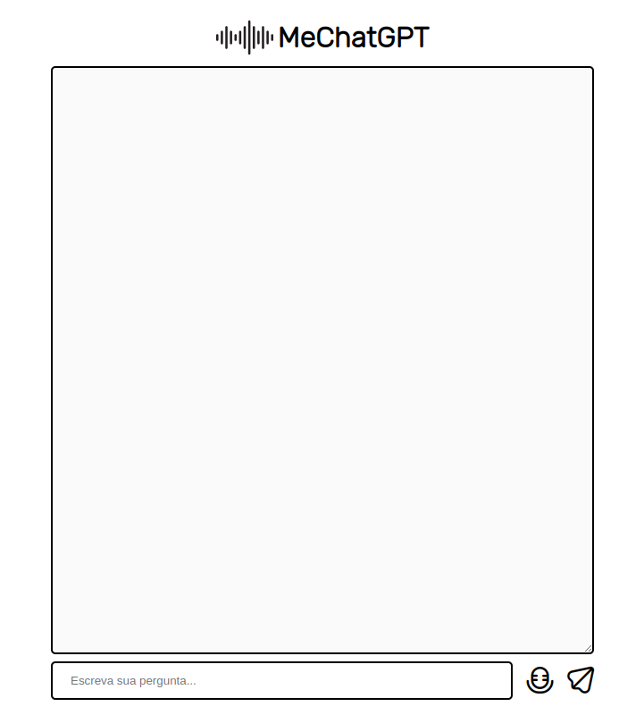

# MeChatGPT

Neste projeto, o objetivo foi criar uma versão personalizada do ChatGPT, implementando a sua API. Além disso, foi adicionada uma nova funcionalidade para que os usuários possam interagir com o modelo de linguagem através da voz. 

## Demo

## To Do
- [ ] Adicionar input para chave da API;
- [ ] Refatorar o código para adicionar boas práticas no nome das varáveis;
- [ ] Refatorar o código para adicionar boas na criação de métodos;
- [ ] Refatorar o código para separar em classes;
- [ ] Fazer tratamento da resposta do chat;
- [ ] Fazer tratamento de erros;
- [ ] Corrigir bug: não reconhece a voz de primeira;
- [ ] Corrigir bug: textos muito grandes, não termina de falar;
- [ ] mudar para node.js;
- [ ] Permitir enviar a pergunta escrita ao pressionar o "Enter";
- [ ] Adicionar histórico de perguntas;
